# 云应用开发实践 —— 实验报告

## 📝 第 1 次实验

**题目要求**

完成小组通讯录，整合前三次课堂练习作业

**完成情况**

已完成小组通讯录，并整合前三次课堂练习作业

**提交编号**

本次实验的最终提交编号为：c89c243

### <font color="#28a745">前三次实验分别在小组成员姓名缩写文件夹</font>

### 👤 刘昆林

**✉️ 提交邮箱**：3539469819@qq.com

#### 📌 任务分工

| 任务模块 | 任务描述 |
| :--- | :--- |
| 小组通讯录 | 收集小组成员的联系方式、个人信息等并完成小组通讯录 |
| 课堂练习 | 完成前三次课堂练习作业 |

#### ✅ 提交记录

| 任务模块 | 提交编号 | 完成情况 |
| :--- | :--- | :--- |
| 小组通讯录 | 10e012a | 完成小组通讯录 |
| 课堂练习1，2 | 9ef6b43 | 完成html和css实验 |
| 课堂练习3 | cfa8f76 | 完成js实验 |

### 👤 邓亚杉

**✉️ 提交邮箱**：<16751151+a-mu-nian-shan@user.noreply.gitee.com>

#### 📌 任务分工

| 任务模块 | 任务描述 |
| :--- | :--- |
| 课堂练习 | 完成前三次课堂练习作业 |

#### ✅ 提交记录

| 任务模块 | 提交编号 | 完成情况 |
| :--- | :--- | :--- |
| 课堂练习1 | fcddf81 | 完成html实验 |
| 课堂练习2 | e4d2595 | 完成css实验 |
| 课堂练习3 | 8d28842 | 完成js实验 |

### 👤 吕毅

**✉️ 提交邮箱**：2115487769@qq.com

#### 📌 任务分工

| 任务模块 | 任务描述 |
| :--- | :--- |
| 课堂练习1&2 | 完成前两次课堂练习作业 |
| 课堂练习3 | 完成第三次课堂练习作业 |
| 课堂练习4 | 完成第三次课堂练习作业 |

#### ✅ 提交记录

| 任务模块 | 提交编号 | 完成情况 |
| :--- | :--- | :--- |
| 课堂练习1 | f2628e8 | html整体开发 |
| 课堂练习2 | f2628e8 | CSS页面美化 |
| 课堂练习3 | 240b4dd | JavaScript按钮元素设置，ico图标功能完善 |
| 课堂练习4 | a1e685b | 使用express，ejs做网页，morgan，winston打印日志，bcryptjs保护密码，新增注册登录功能（不完善），网页听歌观赏视频功能（本地只放少量数据做测试），网页看烟花功能 |

### 👤 华浩然（文件夹hhr）

**✉️ 提交邮箱**：18704801179@163.com

#### 📌 任务分工

| 任务模块 | 任务描述 |
| :--- | :--- |
| 课堂练习1&2&3 | 完成前三次课堂练习作业 |

#### ✅ 提交记录

| 任务模块 | 提交编号 | 完成情况 |
| :--- | :--- | :--- |
| 课堂练习3 | 1dbf866 | 完成JavaScript实验 |
| 课堂练习2 | 672e136 | 完成css实验 |
| 课堂练习1 | c028ba0 | 完成html实验 |


### 👤 施誉飞（文件夹Syf）

**✉️ 提交邮箱**：669401471@qq.com

#### 📌 任务分工

| 任务模块 | 任务描述 |
| :--- | :--- |
| 课堂练习 | 完成前三次课堂练习作业 |

#### ✅ 提交记录

| 任务模块 | 提交编号 | 完成情况 |
| :--- | :--- | :--- |
| 课堂练习1 |  028d42e| html练习,文件名test1.html |
| 课堂练习2 | 1422f0a| css练习,文件名test2.html,mystyle.css |
| 课堂练习3 | 2d9c087| JavaScript练习,文件名 test3.js |


---

## 📝 第 4 次实验

**题目要求**

要求1：P11

要求2：P13

要求3：P23 

每个同学实现自己的版本，和示例要有一定的差异。

---

**完成情况**

已完成第四次实验相关任务。

**提交编号**

本次实验的最终提交编号为：3374d54

### 👤 刘昆林

**✉️ 提交邮箱**：3539469819@qq.com

#### 📌 任务分工

| 任务模块 | 任务描述 |
| :--- | :--- |
| 实验四 | 完成博客系统开发实验前两部分 |


#### ✅ 提交记录

| 任务模块 | 提交编号 | 完成情况 |
| :--- | :--- | :--- |
| 页面输出 | 021ce5c | 完成web创建及优化目录结构 |
| 页面输入 | 3129fc7 | 完成数据的输入输出 |


### 👤 邓亚杉（Dys）

**✉️ 提交邮箱**：<16751151+a-mu-nian-shan@user.noreply.gitee.com>

#### 📌 任务分工

| 任务模块 | 任务描述 |
| :--- | :--- |
| 实验四 | 完成博客系统开发实验前两部分 |

#### ✅ 提交记录

| 任务模块 | 提交编号 | 完成情况 |
| :--- | :--- | :--- |
| 页面输出 | 931ac56 | 完成web创建及优化目录结构 |
| 动态内容 | 4f8d57f | 添加动态内容 |
| 页面输入 | 813568a | 完成数据的输入输出 |

### 👤 吕毅

**✉️ 提交邮箱**：2115487769

#### 📌 任务分工

| 任务模块 | 任务描述 |
| :--- | :--- |
| 课堂练习4 | 完成第四次课堂实验 |

#### ✅ 提交记录

| 任务模块 | 提交编号 | 完成情况 |
| :--- | :--- | :--- |
| 第四次实验 | f36a026 | 登录注册页面，音频视频搜索观看，3D星云背景优化，日志打印 |


### 👤 华浩然(hhr-4)

**✉️ 提交邮箱**：18704801179@163.com

#### 📌 任务分工

| 任务模块 | 任务描述 |
| :--- | :--- |
| 实验四 | 完成博客系统的页面输出，输入功能 |

#### ✅ 提交记录

| 任务模块 | 提交编号 | 完成情况 |
| :--- | :--- | :--- |
| 完成实验四 | 36da8e9 | 输出完整html与静态文件并添加图片、css与动态内容。实现输入数据的处理与输出 |

### 👤 施誉飞（文件夹Syf）

**✉️ 提交邮箱**：669401471@qq.com

#### 📌 任务分工

| 任务模块 | 任务描述 |
| :--- | :--- |
| 课堂练习4 | 完成第四次课堂实验 |

---

#### ✅ 提交记录

| 任务模块 | 提交编号 | 完成情况 |
| :--- | :--- | :--- |
| 文件夹 syf--4 | f64d59a | 使用js实现了页面输入与页面输出 |


## 📝 第 5 次实验

**题目要求**

P29页

把环境（Client、Server）安装好

把4个程序（CRUD）调通


---

**完成情况**
已完成第五次实验相关任务。


**提交编号**
本次实验的最终提交编号为：efafd95


### 👤 刘昆林

**✉️ 提交邮箱**：3539469819@qq.com

#### 📌 任务分工

| 任务模块 | 任务描述 |
| :--- | :--- |
| 实验五 | 安装WSL|


#### ✅ 提交记录

| 任务模块 | 提交编号 | 完成情况 |
| :--- | :--- | :--- |
| 实验五 |  095f8e9 | 成功安装WSL |


### 👤 邓亚杉（Dys）

**✉️ 提交邮箱**：<16751151+a-mu-nian-shan@user.noreply.gitee.com>

#### 📌 任务分工

| 任务模块 | 任务描述 |
| :--- | :--- |
| 实验五 | 安装mongodb |


#### ✅ 提交记录

| 任务模块 | 提交编号 | 完成情况 |
| :--- | :--- | :--- |
| 实验五 | c3599c8 | 成功安装mongodb |


### 👤 吕毅

**✉️ 提交邮箱**：2115487769

#### 📌 任务分工

| 任务模块 | 任务描述 |
| :--- | :--- |
| 实验五 | 安装mongoose |

#### ✅ 提交记录

| 任务模块 | 提交编号 | 完成情况 |
| :--- | :--- | :--- |
| 实验五 | 4a53611 | [成功安装mongoose](D:\Code\cloudappgroup\Alone\第五次实验\log.md) |


### 👤 华浩然(pikeyan-hhr5)

**✉️ 提交邮箱**：18704801179@163.com

#### 📌 任务分工

| 任务模块 | 任务描述 |
| :--- | :--- |
| 实验五 |   实现CRUD功能 |

#### ✅ 提交记录

| 任务模块 | 提交编号 | 完成情况 |
| :--- | :--- | :--- |
| 实现CRUD功能 | f95d85e | 成功实现CRUD功能 |


### 👤 施誉飞（文件夹Syf--5）

**✉️ 提交邮箱**：669401471@qq.com

#### 📌 任务分工

| 任务模块 | 任务描述 |
| :--- | :--- |
| 安装linux |   成功安装linux |


---

#### ✅ 提交记录

| 任务模块 | 提交编号 | 完成情况 |
| :--- | :--- | :--- |
| 安装linux | 8bbc733 | 成功安装linux |


---


# “Cream Market”二手电商平台 —— 实验报告 

以下报告的整体框架与实验总结由Gemini生成

## 一、 实验项目概述

### 1.1 项目背景与简介
本项目名为 **Cream Market**，是一个基于 Node.js 生态构建的综合性电商与二手交易平台。系统旨在模拟真实商业环境下的商品流转，除了具备传统电商的商品浏览、购物车及订单管理功能外，还支持用户对闲置物品的发布处理。

### 1.2 系统架构与技术栈
系统严格遵循 **MVC (Model-View-Controller)** 软件架构规范，具体的层级实现与技术选型如下：

| 层级/类别 | 核心技术 | 说明与职责 |
| :--- | :--- | :--- |
| **运行环境** | **Node.js** | JavaScript 服务端运行环境，支撑整个后端逻辑。 |
| **Web 框架** | **Express.js** | 轻量级框架，负责处理路由、请求响应及中间件逻辑。 |
| **模型层 (Model)** | **MongoDB** + **Mongoose** | 采用 **MongoDB** 作为 NoSQL 文档数据库存储数据；通过 **Mongoose** 实现对象文档映射（ODM），定义数据模型并进行校验。 |
| **视图层 (View)** | **EJS** + **原生 CSS** | 使用 **EJS** 模板引擎实现服务端页面渲染；配合**原生 CSS**（含 Media Queries）实现响应式布局，确保 PC 端与移动端的兼容性。 |
| **控制层 (Controller)** | **Express.js** | 封装核心业务逻辑，隔离路由与数据处理，确保系统解耦。 |

### 1.3 核心技术指标
*   **部署模式**：支持基于 Docker 的数据库容器化部署，简化环境依赖。
*   **响应式设计**：采用原生 CSS Media Queries，确保平台在 PC 端与移动端均有良好的交互体验。
*   **状态管理**：通过 Cookie 机制实现用户会话持久化。

## 二、 小组成员与任务分工
*   **组长 刘昆林（2025080911015）**：
    * 分工贡献权重：20.74%
    * 分工内容：主导项目设计与技术攻关，负责代码优化、审查及测试流程把控。

*   **组员 施誉飞（2025010911013）**：
    * 分工贡献权重：20.20%
    * 分工内容：核心业务开发（商品/购物车/订单/安全修复），实现搜索、筛选、发布管理等关键功能。

*   **成员 华浩然（2025080911008）**：
    * 分工贡献权重：19.54%
    * 分工内容：负责交易平台功能迭代，涵盖智能校验、防重发检测、个性化推荐、价格追踪及信誉评价体系。

*   **成员 吕毅（2025120901016）**：
     * 分工贡献权重：19.98%
    * 分工内容：前端架构与体验优化，完成页面设计、登录安全（验证码/防刷）、IM沟通、主题切换及UI交互。

*   **成员 邓亚杉（2025080909002）**：
     * 分工贡献权重：19.54%
    * 分工内容：负责实验报告撰写及整合优化。


## 三、 实验环境与技术栈

* **运行环境**：Linux (支持 Docker 容器化运行环境)

* **后端开发语言**：Node.js (Express 框架)

* **数据库系统**：MongoDB (基于 Docker 部署)

* **前端技术**：EJS 模板引擎 + 原生 CSS (响应式适配)


## 四、 系统功能模块设计

1. **用户认证系统**：基于 Cookie 的注册、登录、安全退出与注销机制。

2. **商品商城与展示模块**：支持关键词搜索、分类筛选及“二手交易专区”独立展示。会根据用户浏览历史、购物车及购买记录推送相关商品。同时新增二手商品价格波动记录与可视化功能，以及完整的卖家信誉与交易评价体系。

3. **商品管理模块**：支持发布、查看、编辑以及删除商品信息（完整 CRUD）。发布页面实现智能校验与优化建议功能以及商品防重复发布检测功能。

4. **购物车与订单模块**：支持商品增减、一键清空及完整的订单结算流转，额外增加联系卖家功能。


## 五、 实验步骤与运行过程
    * 详见readme文件 
### 5.1 环境准备
```bash
npm install
```

### 5.2 数据库部署
```bash
# 安装 Docker(首次使用)
sudo apt install -y docker.io
# 创建并启动 MongoDB 容器
sudo docker run -d -p 27017:27017 --name mongodb mongo
# 验证 MongoDB 容器状态
sudo docker ps -a
```

### 5.3 应用启动与数据初始化
```bash
node server.js
```
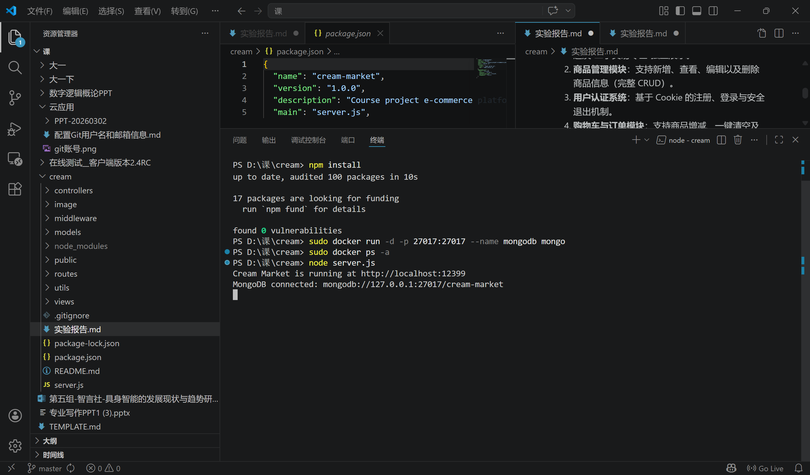


## 六、 核心测试与效果演示 

### 6.1 用户系统演示
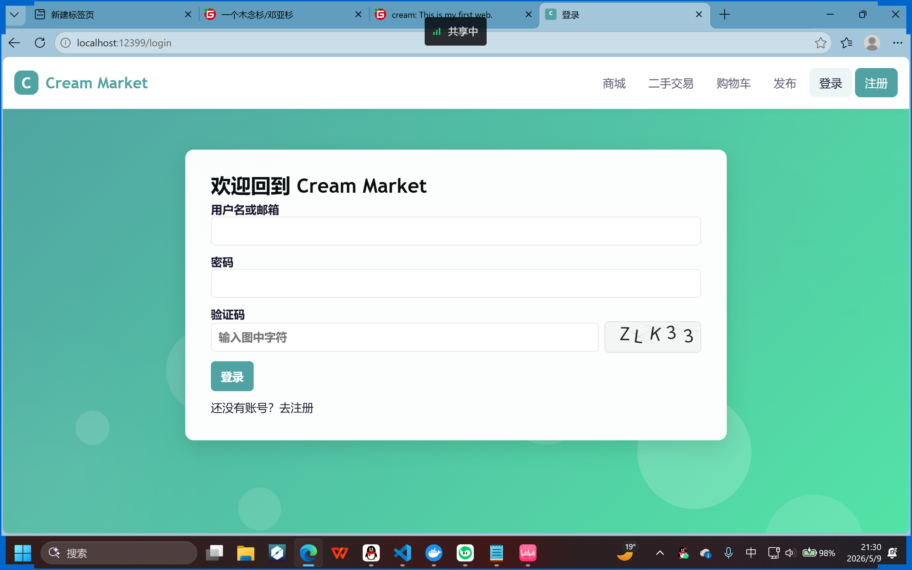
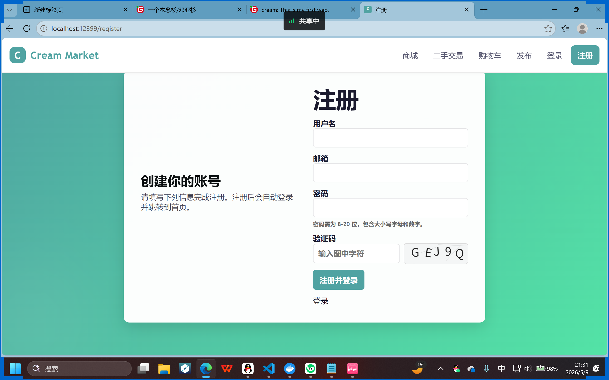

### 6.2 二手专区与搜索过滤
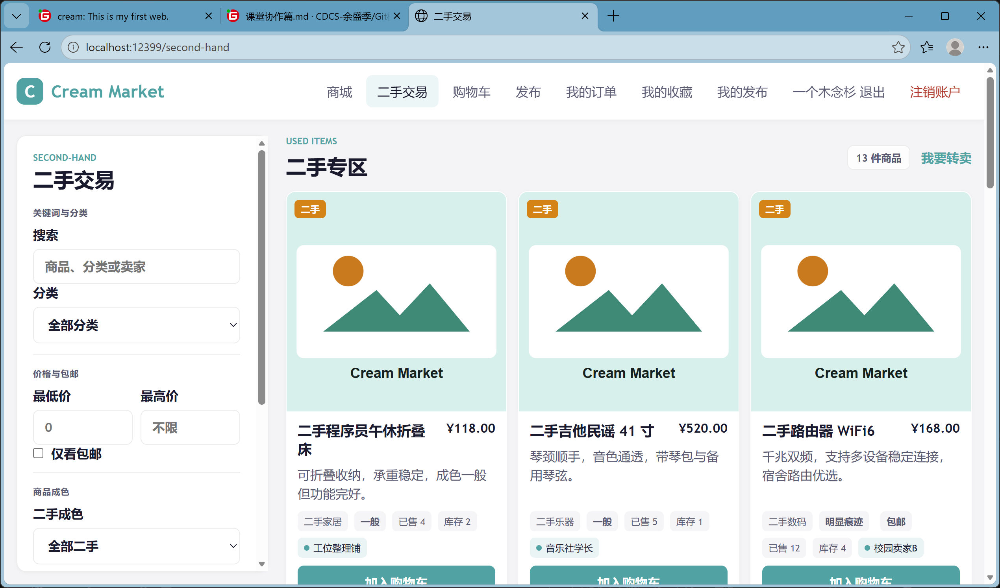
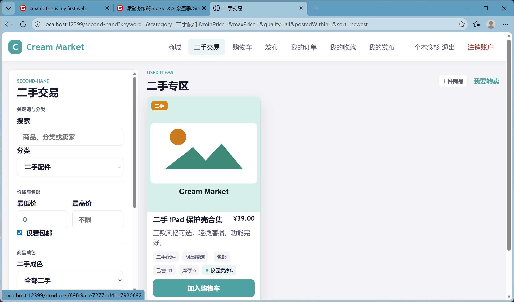

### 6.3 商品信息展示
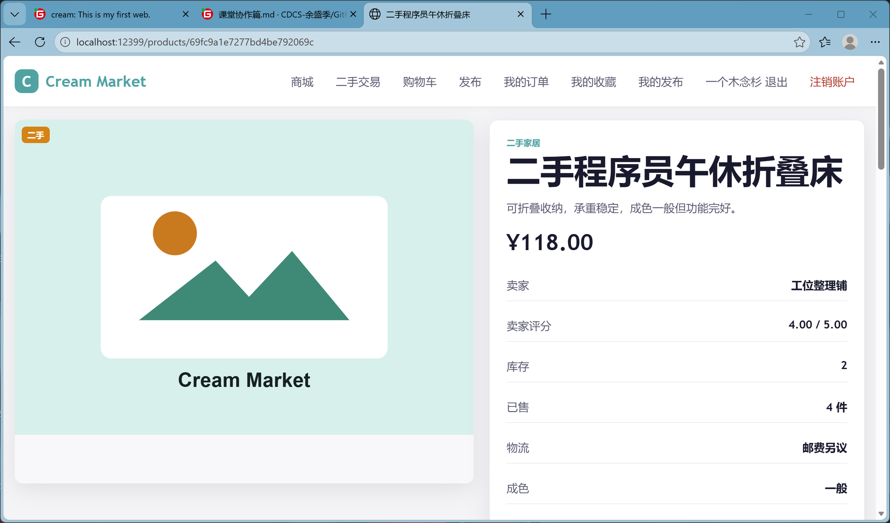
    商品评价
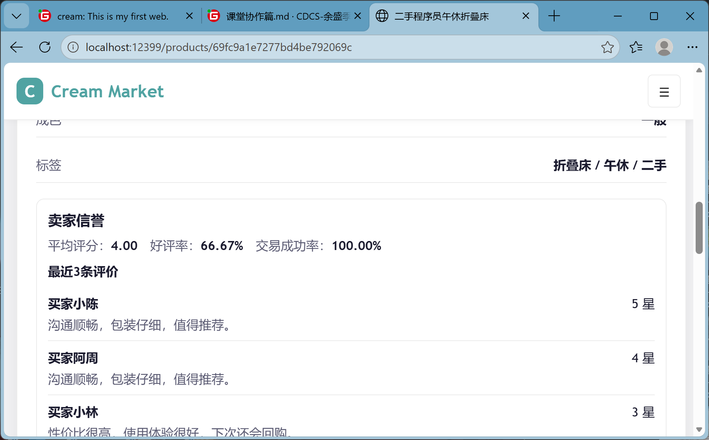
    价格走势
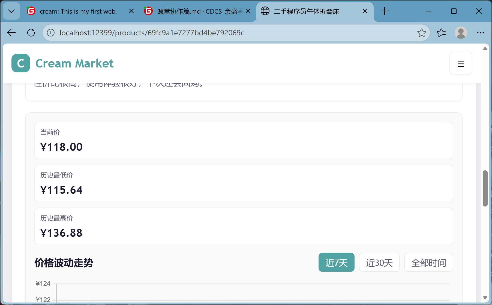
    智能推荐
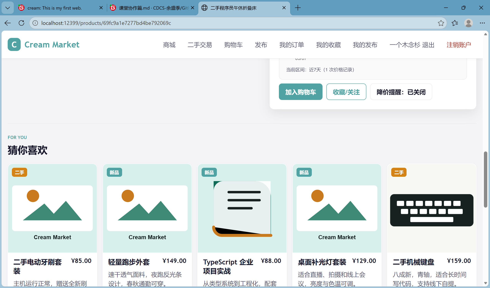

### 6.4 购物车与订单结算
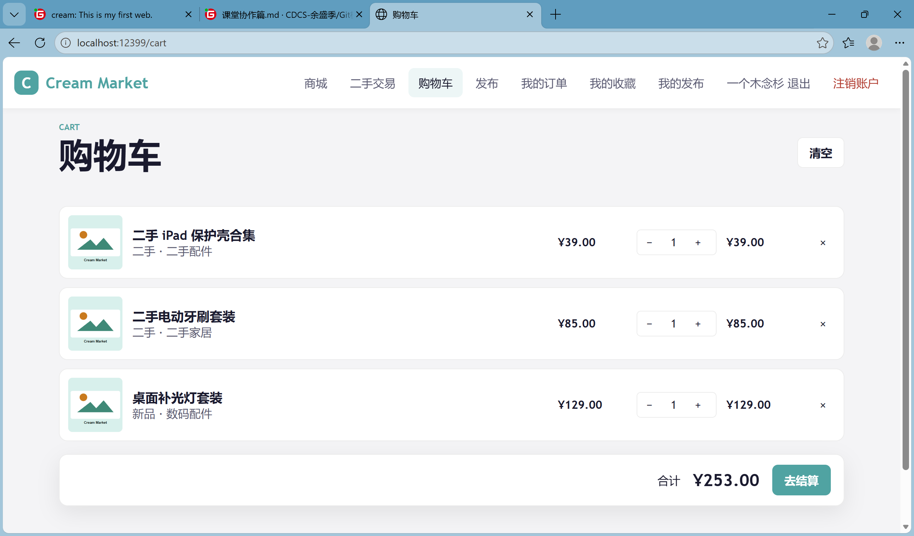
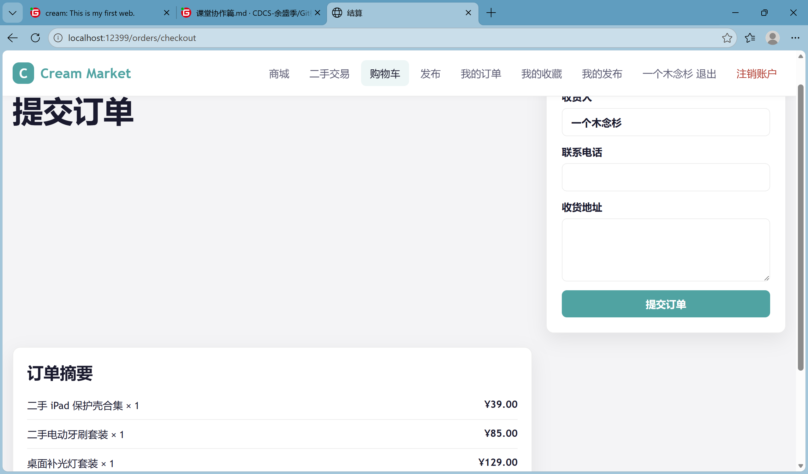
评价体系
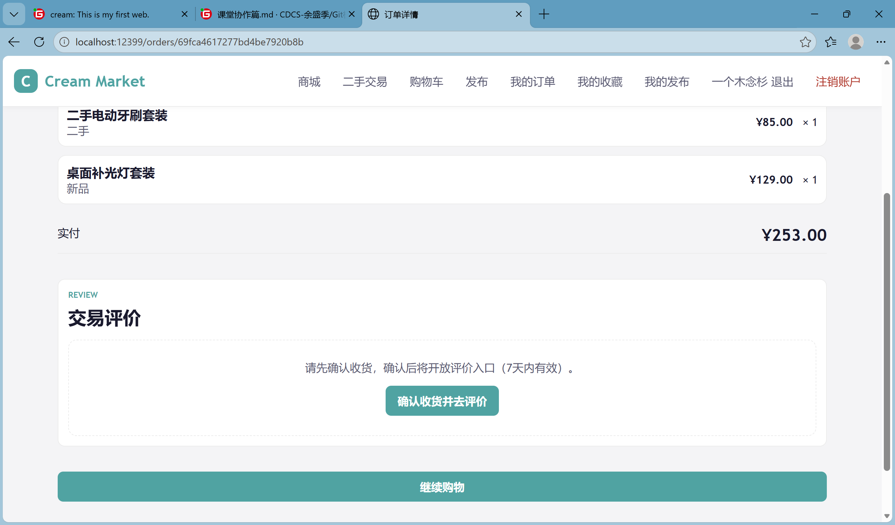
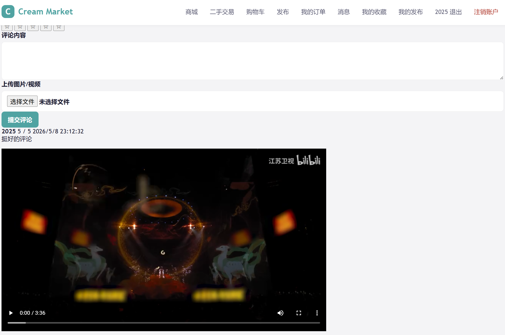

### 6.5 商品发布
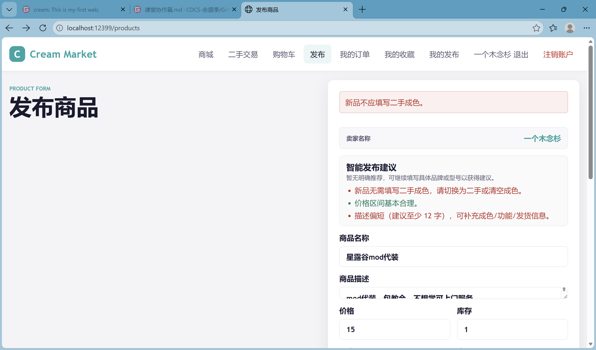
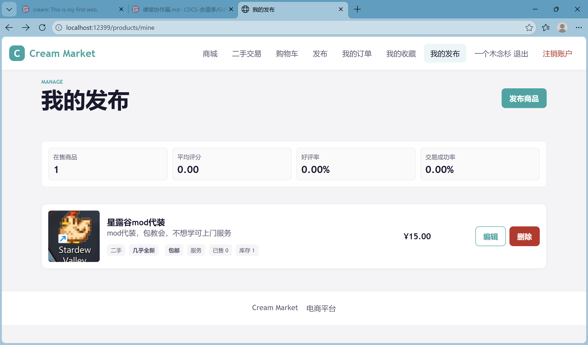

### 6.6 移动端ui适配
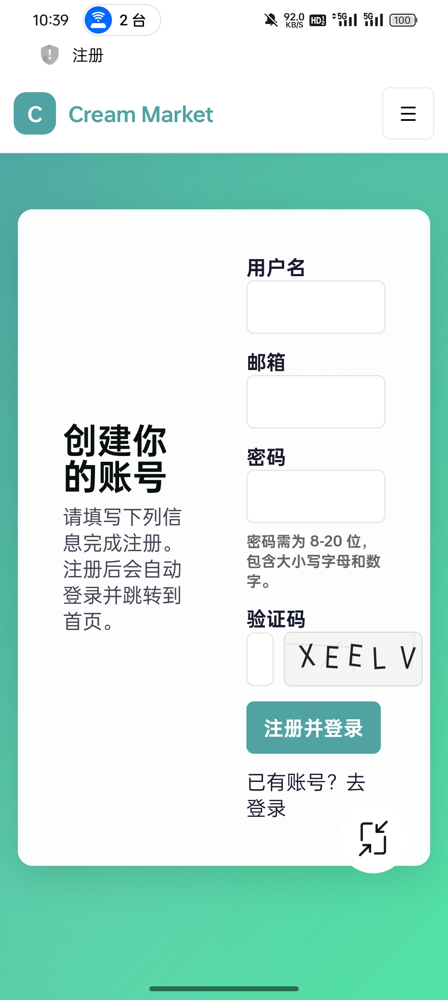

### 6.7 页面体验优化
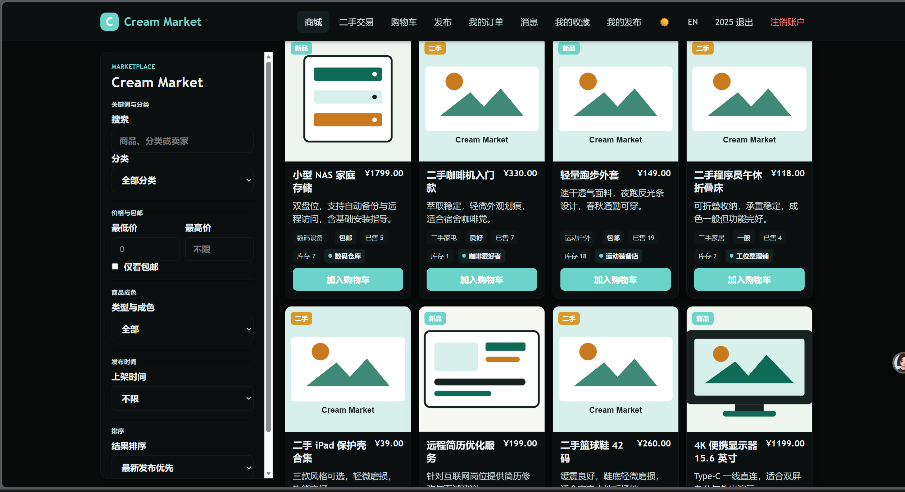


## 七、 实验总结与评分点评估

* 本次实验基于 Node.js + Express 构建了 "Cream Market" 二手电商平台。系统采用 MVC 架构，利用 MongoDB 存储数据，通过 Docker 完成数据库部署。实现了用户 Cookie 鉴权、商品 CRUD、二手专区筛选及购物车订单闭环等核心功能。前端使用 EJS 渲染，配合原生 CSS 实现响应式适配，完整达成了实验目标。

1. **页面输出**：成功利用 EJS 模板引擎实现了动态页面的服务端渲染。系统能够根据数据库中的数据变化，实时更新商品列表页、二手专区及购物车页面。同时优化显示，实现日间模式和夜间模式（屏幕白色&暗色）以及语言汉英翻译按钮。


2. **页面输入**：规范实现各业务模块的 POST 提交机制。

3. **数据处理**：深度整合 MongoDB​ 数据库，利用 Mongoose​ 建立了 User、Product、Order 等数据模型。系统高效完成了对商品信息的增删改查（CRUD）操作，

4. **系统创新性**：在基础电商功能之上，构建了完整的交易闭环。
    * 区别于单一的商城展示，本项目特别划分了“二手交易专区”，实现了对新品与二手商品的分类管理。
    * 通过原生 CSS Media Queries​ 实现了响应式布局，确保在 PC 端与移动端均能正常交互，提升了系统的实用性。
    * 实现完整的卖家信誉与交易评价体系。
    * 实现二手商品价格波动记录与可视化功能。
    * 基于用户的浏览历史、购物车商品和购买记录，实现商品智能推荐功能。
    * 增加管理员功能，超级管理员账号密码superadmin，默认管理员账号密码是admin，超级管理员可以任免任意用户为管理员和删除用户，管理员可以删除非管理员用户。
