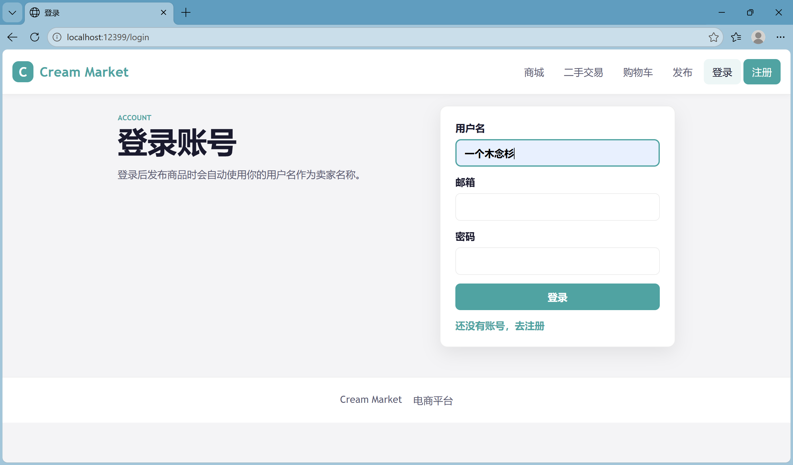
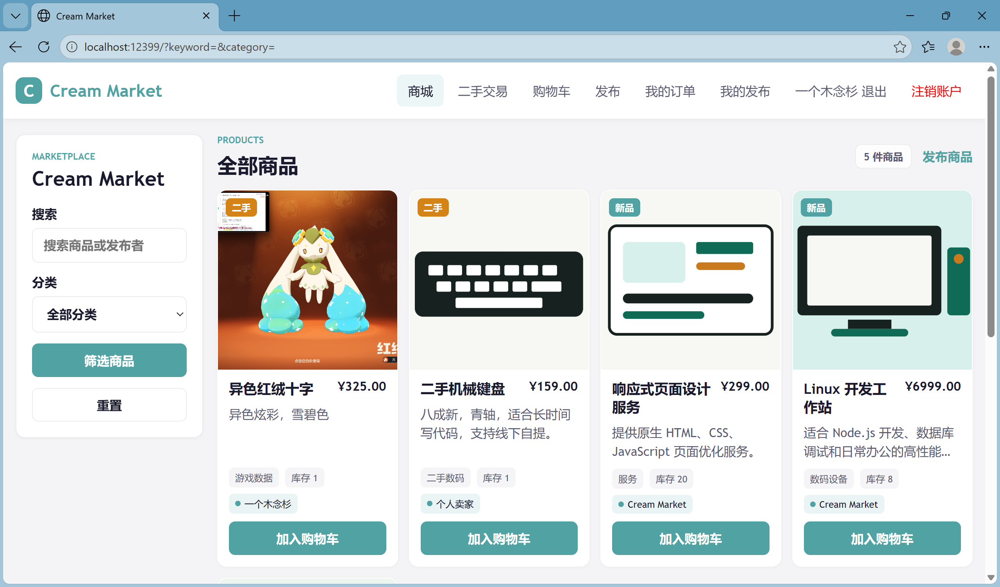
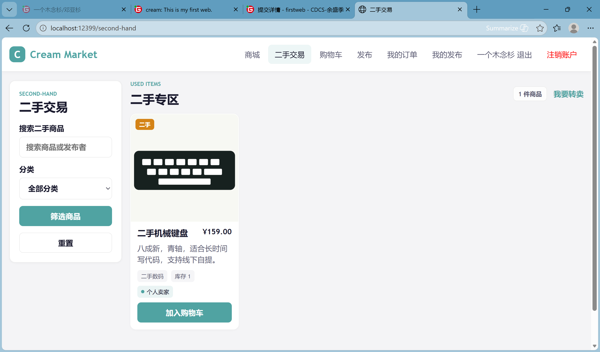
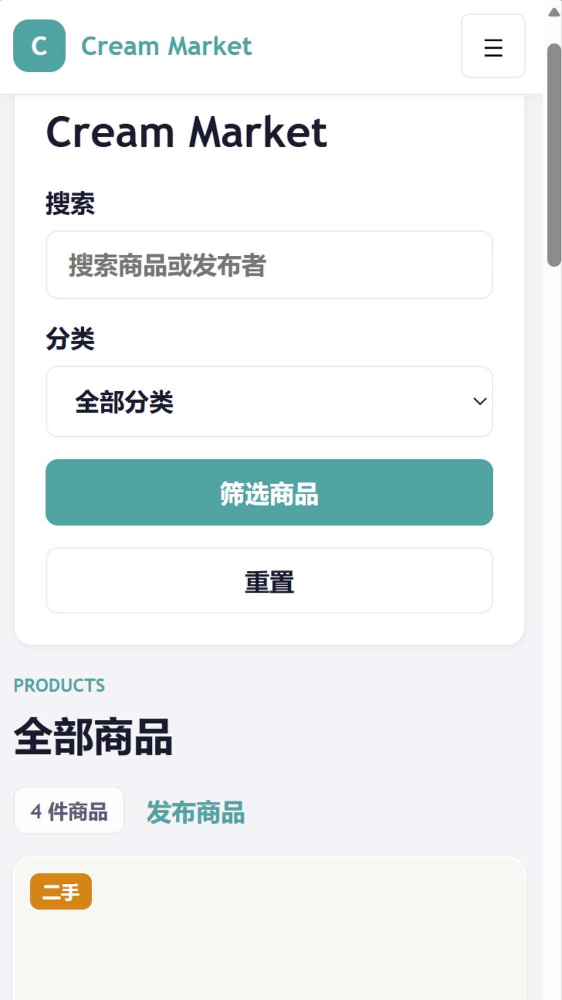

# “Cream Market”二手电商平台 —— 实验报告 

以下报告的整体框架与实验总结由Gemini生成

## 一、 实验项目概述

### 1.1 项目背景与简介
本项目名为 **Cream Market**，是一个基于 Node.js 生态构建的综合性电商与二手交易平台。系统旨在模拟真实商业环境下的商品流转，除了具备传统电商的商品浏览、购物车及订单管理功能外，还支持用户对闲置物品的发布处理。

### 1.2 系统架构说明
系统严格遵循 **MVC (Model-View-Controller)** 软件架构规范：
*   **模型层 (Models)**：利用 Mongoose 驱动 MongoDB 实现非关系型数据建模。
*   **视图层 (Views)**：采用 EJS 模板引擎实现服务端页面渲染。
*   **控制层 (Controllers)**：封装核心业务逻辑，确保请求处理与数据操作的解耦。

### 1.3 核心技术指标
*   **部署模式**：支持基于 Docker 的数据库容器化部署，简化环境依赖。
*   **响应式设计**：采用原生 CSS Media Queries，确保平台在 PC 端与移动端均有良好的交互体验。
*   **状态管理**：通过 Cookie 机制实现用户会话持久化。

## 二、 小组成员与任务分工
*   **组长 刘昆林（2025080911015）**：

*   **组员 施誉飞（2025010911013）**：

*   **成员 华浩然（2025080911008）**：

*   **成员 吕毅（2025120901016）**：

*   **成员 邓亚杉（2025080909002）**：负责实验报告撰写及优化。


## 三、 实验环境与技术栈

* **运行环境**：Linux (支持 Docker 容器化运行环境)

* **后端开发语言**：Node.js (Express 框架)

* **数据库系统**：MongoDB (基于 Docker 部署)

* **前端技术**：EJS 模板引擎 + 原生 CSS (响应式适配)


## 四、 系统功能模块设计

1. **商品商城与展示模块**：支持关键词搜索、分类筛选及“二手交易专区”独立展示。

2. **商品管理模块**：支持新增、查看、编辑以及删除商品信息（完整 CRUD）。

3. **用户认证系统**：基于 Cookie 的注册、登录与安全退出机制。

4. **购物车与订单模块**：支持商品增减、一键清空及完整的订单结算流转。


## 五、 实验步骤与运行过程

### 5.1 环境准备
```bash
npm install
```

### 5.2 数据库部署
```bash
sudo docker run -d -p 27017:27017 --name mongodb mongo
sudo docker ps -a
```

### 5.3 应用启动与数据初始化
```bash
node server.js
```


## 六、 核心测试与效果演示 

### 6.1 用户系统演示



### 6.2 二手专区与搜索过滤




### 6.3 购物车与订单结算


### 6.4 商品发布


### 6.5 移动端ui适配



## 七、 实验总结与评分点评估

* 本次实验基于 Node.js + Express 构建了 "Cream Market" 二手电商平台。系统采用 MVC 架构，利用 MongoDB 存储数据，通过 Docker 完成数据库部署。实现了用户 Cookie 鉴权、商品 CRUD、二手专区筛选及购物车订单闭环等核心功能。前端使用 EJS 渲染，配合原生 CSS 实现响应式适配，完整达成了实验目标。

1. **页面输出**：成功利用 EJS 模板引擎实现了动态页面的服务端渲染。系统能够根据数据库中的数据变化，实时更新商品列表页、二手专区及购物车页面。

2. **页面输入**：规范实现各业务模块的 POST 提交机制。

3. **数据处理**：深度整合 MongoDB​ 数据库，利用 Mongoose​ 建立了 User、Product、Order 等数据模型。系统高效完成了对商品信息的增删改查（CRUD）操作，

4. **系统创新性**：在基础电商功能之上，构建了完整的交易闭环。区别于单一的商城展示，本项目特别划分了“二手交易专区”（图6.2.3），实现了对新品与二手商品的分类管理。同时，通过原生 CSS Media Queries​ 实现了响应式布局，确保在 PC 端与移动端（图6.5）均能正常交互，提升了系统的实用性。
